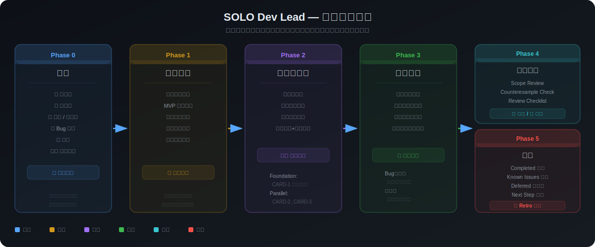
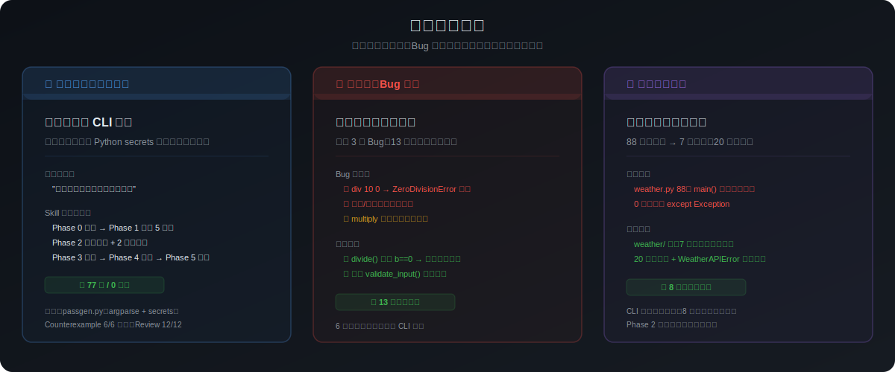
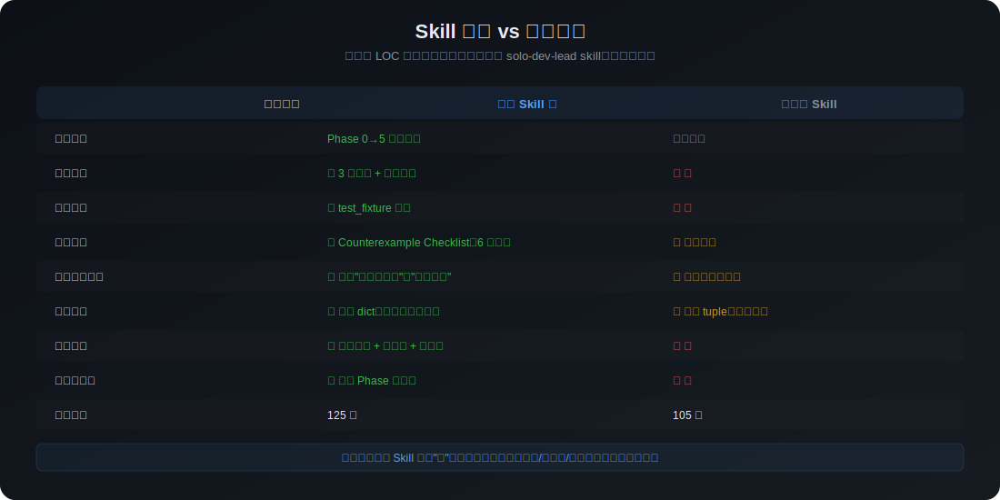
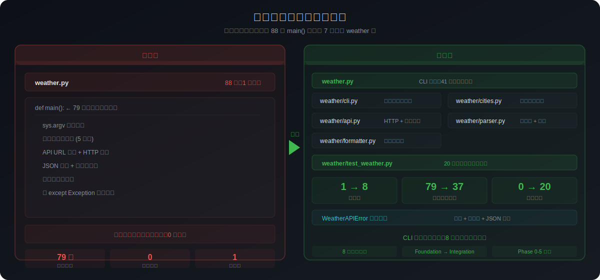
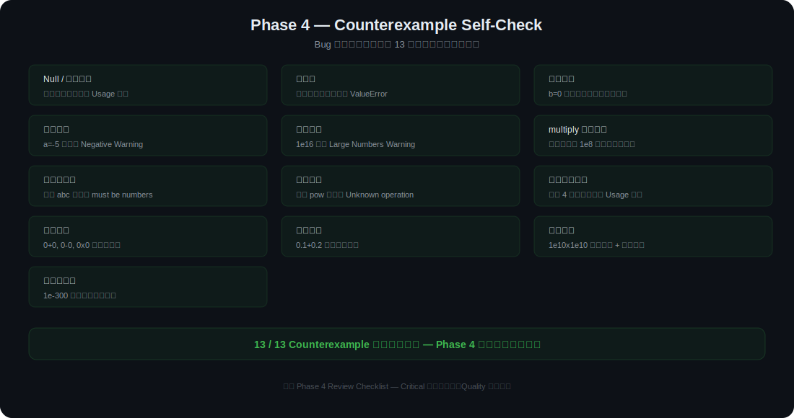

# SOLO Dev Lead

让 TRAE SOLO 像技术负责人一样拆解、实现和 Review 软件需求。



SOLO Dev Lead 是一个面向软件开发场景的 TRAE SOLO Skill。它会让 SOLO 不再只是收到需求就立刻写代码，而是先扮演一个有工程纪律的 Tech Lead：识别需求类型、确认产品范围、做架构决策、拆解任务卡、组织实现、验证测试、Review diff，最后输出 Retro。

适合产品经理、独立开发者、AI 编程学习者，以及想让 SOLO 更稳定地处理新项目、新功能、Bug 修复和重构的用户。

## 为什么做它

AI coding 很快，但如果没有流程约束，常见问题也很明显：

- 需求边界没确认就开始改代码；
- 没有任务卡和可验证的验收标准；
- 小改动、大改动和重构混在一起；
- 测试只写“已通过”，看不出验证了哪些路径；
- 做完没有复盘，下一轮继续时上下文又散掉。

SOLO Dev Lead 把一次开发请求拆成 5 个阶段：

1. **Phase 0**：判断任务类型，新项目、小改动、新功能、Bug、重构或架构变更。
2. **Phase 1**：只问会影响实现的关键产品问题。
3. **Phase 2**：锁定技术决策，并拆成可执行任务卡。
4. **Phase 3**：按任务卡执行，保留范围边界。
5. **Phase 4/5**：Review、验证、Retro 和下一步建议。

## 展示素材

### 三个典型场景

覆盖新项目启动、Bug 修复和重构，展示 Skill 如何把不同类型的软件需求带入不同流程。



### 使用 Skill vs 不使用 Skill

同一个 LOC 统计工具任务，对比使用 Skill 后在任务卡、验收标准、边界检查、复盘记录上的差异。



### 重构场景里的架构保护

重构不只是“拆文件”，还需要保护外部行为、回归测试和模块边界。



### 反例驱动自检

把 Null、空输入、边界值、外部依赖失败、并发和恶意输入沉淀成固定检查项。



## 安装和使用

推荐方式：

1. 下载或复制 `solo-dev-lead` 文件夹。
2. 在 TRAE SOLO 中打开 Skills 管理入口。
3. 导入 `solo-dev-lead/SKILL.md`，或把整个 `solo-dev-lead` 文件夹放入项目 Skill 目录。
4. 在 SOLO 对话中输入：

```text
/dev 我想做一个带登录和任务管理的 Todo 应用
```

也可以直接说：

```text
使用 solo-dev-lead，帮我把这个新功能按技术负责人流程拆解并实现。
```

## Skill 结构

```text
solo-dev-lead/
  SKILL.md
  references/
    phase1-product-alignment.md
    phase2-architecture-and-tasking.md
    phase3-solo-execution.md
    phase4-review-and-verification.md
    phase5-retro.md
    task-card-template.md
    project-context-template.md
```

## 公开链接

https://github.com/hnaymyh123-henry/solo-dev-lead

## 说明

这个 Skill 改造自我之前为 Claude Code 设计的 `/dev` 多 Agent 软件开发 SOP。TRAE 版本移除了 Claude Code 专属命令路径，把 GitHub Issue、PR 和 worktree 从硬依赖改为可选增强，并增加了本地任务卡、分支和 diff review fallback，更适合 SOLO 的使用方式。

## License

MIT
